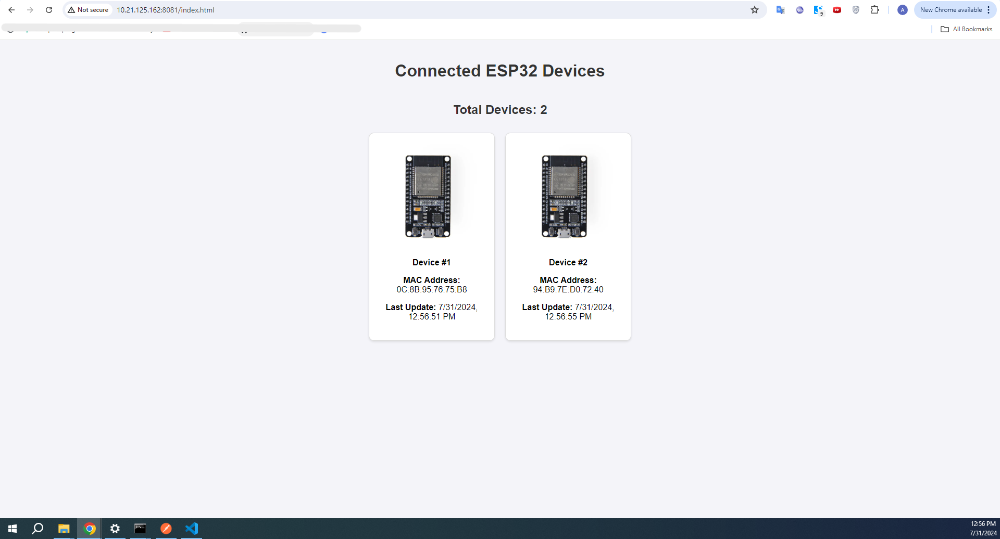

# ESP32 Device Monitor

This project allows you to monitor ESP32 devices connected to a specified WiFi network. The system displays the MAC addresses of all connected ESP32 devices on a dynamically updating webpage.

## Features

- Display the MAC addresses of all connected ESP32 devices.
- Dynamically update the webpage with the list of devices.
- Automatically remove devices that are no longer active.
- Show the total number of connected devices.
- Assign a unique number to each connected ESP32 device.

## Prerequisites

- Node.js
- npm (Node Package Manager)
- ESP32 devices
- WiFi network

## Getting Started

### Clone the Repository

```bash
git clone https://github.com/ashtam55/esp32-device-monitor.git
cd ESP32-WIFI-Monitor
```

## Setup

### Backend Setup

Navigate to the server directory

```bash
cd testright-iot-backend-server
```

Install the required packages

```bash
npm install
```
Run the server

```bash
node main.js
```

### Frontend Setup

1. **Replace placeholders:**

   - Replace `localhost/IP` in the `index.html` with your actual server information.

2. **Run:**
    - Goto the server directory and run the following command to host the ```index.html``` file on your local network.
    ```
    http-server
    ```
    This will gives you an IP address similar to this ```http://10.21.125.162:8081``` now add the index.html path in this address ```http://10.21.125.162:8081/index.html``` and hit enter. You can able to access this on any device connected to the same network.

     

### ESP32 Setup

Load the code given in folder ```IoT-Testright-esp32-code``` onto each ESP32 device. Make sure to update the ```SSID, PASSWORD, and SERVERURL``` variables with your WiFi network details and server URL. Then upload the code to each ESP32 device using the Arduino IDE or PlatformIO.

To find the IP address of your server/PC on which you are running the server code use the following command 
```bash
ipconfig
```
This will give you the IP address use the IPv4 Address.

## Usage
1. Make sure the backend server is running.
2. Open the index.html using the URL.
3. The webpage will display the connected ESP32 devices and update every 5 seconds.

## Video